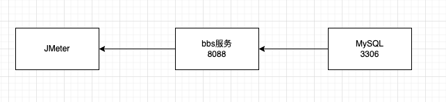
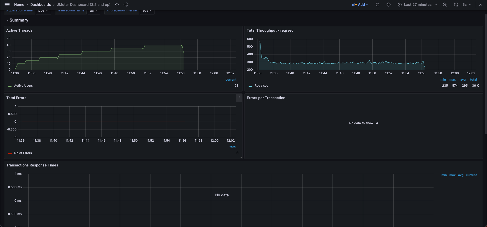
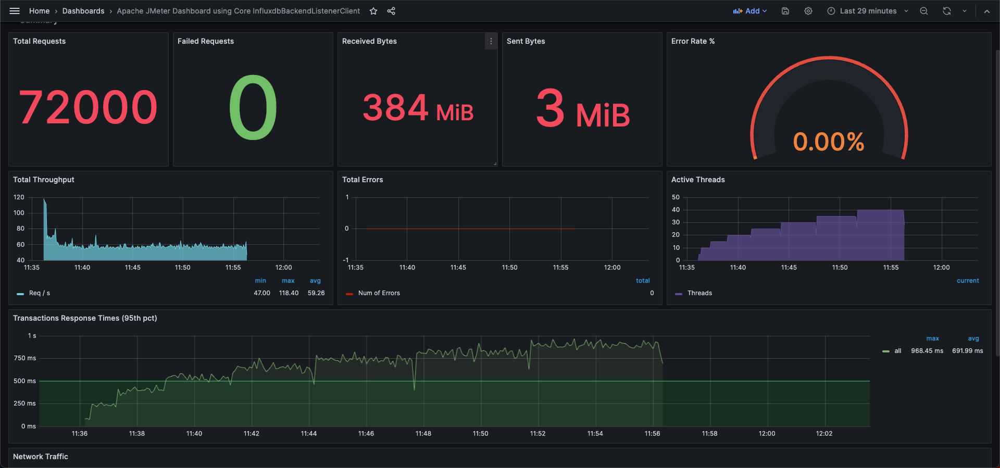
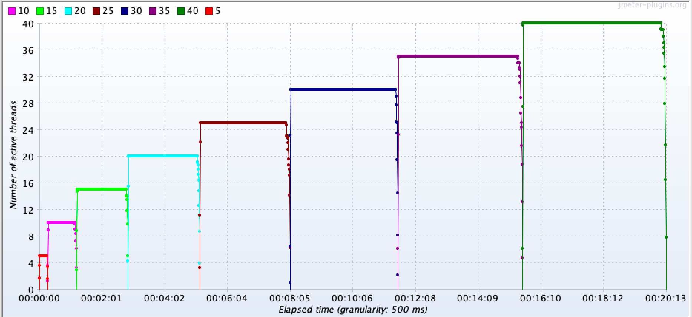
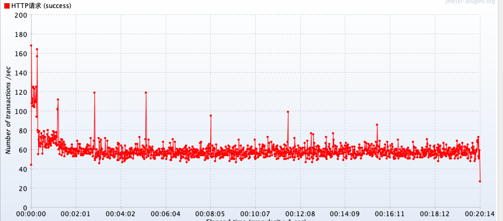
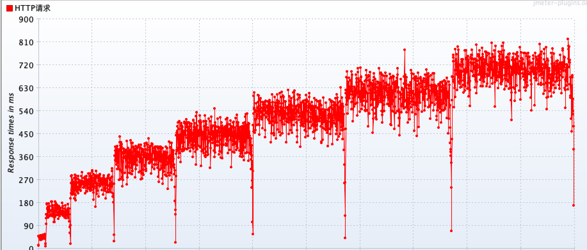
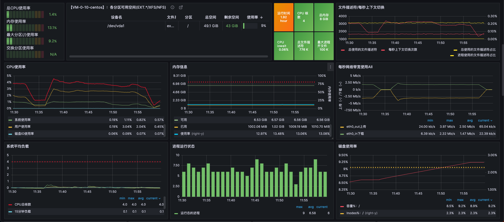
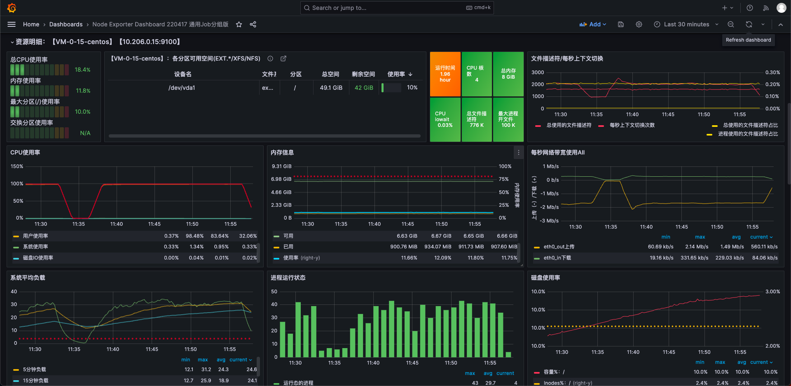

# 项目性能测试报告

## 01-测试目的

主要是让开发者对bbs项目（https://github.com/theoriz0/simple-bbs-api）的性能负载和容量有个准确的认知。同时，协助技术管理者更好的管理业务系统性能质量，科学评估业务系统的负荷，拒绝盲目上线。

## 02-测试工具

## 03-测试环境

### 3.1 环境

| 指标     | 参数    |
| -------- | ------- |
| 机器     | 4C8G50M |
| 集群规模 | 单机    |
| bbs版本  | 1.0.1   |
| 数据库   | 4C8G50M |

### 3.1 设置启动参数

OpenJDK Runtime Environment Zulu11.66+15-CA (build 11.0.20+8-LTS) 默认参数。

## 04-测试场景

验证bbs服务获取主题接口在不同并发规模的表现

**模拟场景:**用户访问接口并发逐渐增加的过程。线程梯度：5、10、15、20、25、30、35、40个线程，400次;

**对应文件**：topics.jmx（gen_posts.jmx用于批量生成topics）

## 05-获取主题接口的测试结果

验证bbs服务获取主题接口能力性能。结果原文件：result2.jtl。

Grafana Jmeter看板

Threads

TPS

RT

Application服务器性能监控

MySQL服务器性能监控

## 06-性能问题分析

MySQL服务器CPU资源占用过高(100%)，网络负载、内存负载、硬盘负载正常；应用服务器整体负载正常。分析可知目前接口性能瓶颈在MySQL服务器，优化可能方案：

1. 优化SQL语句，提升性能；
2. 引入Redis缓存/内存缓存；
3. 使用NoSQL作为数据存储。