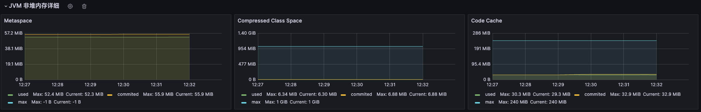
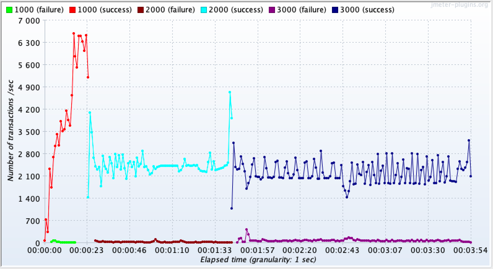

# 高负载场景模拟与JVM观察

压力测试工具：JMeter-内网；JVM观察工具：Grafana、GCEasy

低延时接口：/spu/goods/10000023827800

高延时接口：/spu/goods/slow/10000023827800

## 1. 吞吐量优先

```sh
# 吞吐量优先策略： 
JAVA_OPT="${JAVA_OPT} -Xms256m -Xmx256m -Xmn125m -XX:MetaspaceSize=128m - Xss512k" 
JAVA_OPT="${JAVA_OPT} -XX:+UseParallelGC -XX:+UseParallelOldGC"
JAVA_OPT="${JAVA_OPT} -XX:+PrintGCDetails -XX:+PrintGCTimeStamps - XX:+PrintGCDateStamps -XX:+PrintHeapAtGC -Xloggc:${BASE_DIR}/logs/gc-ps-po.log" 
```

### 低延迟

测试开始时间：12:27 测试结束时间：12:32

吞吐量


RT


TPS


GC 的统计信息


堆内存统计信息





### 高延迟

测试开始时间：12:48 测试结束时间：12:59

吞吐量


RT


TPS


GC 的统计信息


堆内存统计信息


## 2. 响应时间优先

```sh
# 响应时间优先策略 
JAVA_OPT="${JAVA_OPT} -Xms256m -Xmx256m -Xmn125m -XX:MetaspaceSize=128m - Xss512k" 
JAVA_OPT="${JAVA_OPT} -XX:+UseParNewGC -XX:+UseConcMarkSweepGC "
JAVA_OPT="${JAVA_OPT} -XX:+PrintGCDetails -XX:+PrintGCTimeStamps - XX:+PrintGCDateStamps -XX:+PrintHeapAtGC -Xloggc:${BASE_DIR}/logs/gc-parnew- cms.log" 
```

### 低延迟

测试开始时间：13:08 测试结束时间：13:15

吞吐量


RT


TPS


GC 的统计信息


堆内存统计信息


### 高延迟

测试开始时间：13:17 测试结束时间：13:26

吞吐量


RT


TPS


GC 的统计信息


堆内存统计信息


## 3. G1

```sh
# 全功能垃圾收集器 
JAVA_OPT="${JAVA_OPT} -Xms256m -Xmx256m -XX:MetaspaceSize=128m -Xss512k"
JAVA_OPT="${JAVA_OPT} -XX:+UseG1GC -XX:MaxGCPauseMillis=100"
JAVA_OPT="${JAVA_OPT} -XX:+PrintGCDetails -XX:+PrintGCTimeStamps - XX:+PrintGCDateStamps -XX:+PrintHeapAtGC -Xloggc:${BASE_DIR}/logs/gc-g- one.log"
```

### 低延迟

测试开始时间：13:35 测试结束时间：13:39

吞吐量


RT


TPS



GC 的统计信息


堆内存统计信息


### 高延迟

测试开始时间：13:44 测试结束时间：13:54

吞吐量


RT


TPS


GC 的统计信息


堆内存统计信息


