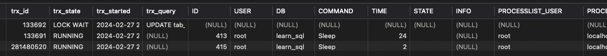
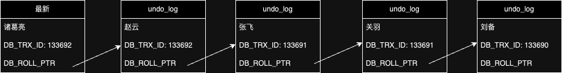

# 题目 01- 完成 ReadView 案例，解释为什么 RR 和 RC 隔离级别下看到查询结果不一致
## 案例 01- 读已提交 RC 隔离级别下的可见性分析

- 目标：通过分析的ReadView，理解RC隔离级别下不同事务间操作的可见性

- 操作步骤

  | 时间 | Tx1                         | Tx2                           | Tx3                      |
  | ---- | --------------------------- | ----------------------------- | ------------------------ |
  | T1   | begin;                      | begin;                        | begin;                   |
  | T2   | name = '关羽' WHERE id = 1; |                               |                          |
  | T3   | name = '张飞' WHERE id = 1; |                               |                          |
  | T4   |                             | name = '赵云' WHERE id = 1;   |                          |
  | T5   |                             | name = '诸葛亮' WHERE id = 1; |                          |
  | T6   |                             |                               | SELECT ... WHERE id = 1; |
  | T7   | commit;                     |                               |                          |
  | T8   |                             |                               | SELECT ... WHERE id = 1; |
  | T9   |                             | commit;                       |                          |
  | T10  |                             |                               | SELECT ... WHERE id = 1; |

- 实践过程

  - 创建表（略）
  - 设置隔离级别：`set session transaction isolation level read committed;`
  - 启动3个事务
  - Tx1 update；
  - Tx2 update，由于Tx1锁未释放，所以会等待
  - Tx3 查询，由于Tx1未提交，所以结果是【刘备】
  - Tx1 提交，Tx3查询，结果是【张飞】
  - Tx2 提交，Tx3查询，结果是【诸葛亮】
  - Tx3 提交

- 结论

  - 在Tx3运行过程中，根据Tx1、Tx2是否提交状态的不同，读到的数据会发生变化，属于【不可重复读】
  - RC未能解决不可重复读问题，问题仍存在。

## 案例 02- 可重复读 RR 隔离级别下的可见性分析

- 目标：通过分析的ReadView，理解RR隔离级别下不同事务间操作的可见性
- 操作步骤：同案例1，但是设置`set session transaction isolation level read repeated;`
- 实践过程
  - 创建表（略）
  - 设置隔离级别：`set session transaction isolation level read repeated;`
  - 启动3个事务
  - Tx1 update；
  - Tx2 update，由于Tx1锁未释放，所以会等待
  - Tx3 查询，结果是【刘备】
  - Tx1 提交，Tx3查询，结果是【刘备】
  - Tx2 提交，Tx3查询，结果是【刘备】
  - Tx3 提交

- 结论
  - 在Tx3运行过程中，读到的数据不会发生变化，不存在【不可重复读】
  - RR解决了不可重复读问题。

- 结论分析

  - ReadView是张存储事务id的表，主要包含当前系统中有哪些活跃的读写事务，把它们的事务id放到一个 列表中。结合Undo日志的默认字段【事务trx_id】来控制那个版本的Undo日志可被其他事务看见。

  - Trx_id

    
  
  - T6时刻，Undo日志版本链对应如下（简化）
  
    
  
  - T6时刻，开启事务后发生了第一次select语句，生成ReadView。这里RR和RC结果相同，都会返回【刘备】

    - 系统中活跃的读写事务id列表m_ids：133692、133691、281480520
    - m_low_limit_id最小事务id：133693
    - m_up_limit_id最大事务id：133691
    - m_creator_trx_id：281480520
    - 最新m_up_limit_id 133691 <= trx_id 133692 < m_low_limit_id 133693，但是m_ids中有133692，所以继续比较DB_Roll_ptr指针指向的赵云那条记录
    - 赵云m_up_limit_id 133691 <= trx_id 133692 < m_low_limit_id 133693，但是m_ids中有133692，所以继续比较DB_Roll_ptr指针指向的张飞那条记录
    - 张飞m_up_limit_id 133691 <= trx_id 133691 < m_low_limit_id 133693，但是m_ids中有133691，所以继续比较DB_Roll_ptr指针指向的关羽那条记录
    - 关羽m_up_limit_id 133691 <= trx_id 133691 < m_low_limit_id 133693，但是m_ids中有133691，所以继续比较DB_Roll_ptr指针指向的刘备那条记录
    - 刘备trx_id 133690<m_up_limit_id 133691，返回刘备
  
  - T8时刻，发生第二次select语句。RR仍然使用T6生成的ReadView，结果仍为刘备。RC会生成新的ReadView。
  
    - 此时系统中133691已经结束，活跃的读写事务id列表m_ids：133692、281480520
    - m_low_limit_id最小事务id：133693
    - m_up_limit_id最大事务id：133692
    - m_creator_trx_id：281480520
    - 最新m_up_limit_id 133692 <= trx_id 133692 < m_low_limit_id 133693，但是m_ids中有133692，所以继续比较DB_Roll_ptr指针指向的赵云那条记录
    - 赵云m_up_limit_id 133692 <= trx_id 133692 < m_low_limit_id 133693，但是m_ids中有133692，所以继续比较DB_Roll_ptr指针指向的张飞那条记录
    - 张飞trx_id 133691<m_up_limit_id 133692，RC情况下，返回张飞。
  
  - T10时刻，发生第二次select语句。RR仍然使用T6生成的ReadView，结果仍为刘备。RC会生成新的ReadView。
  
    - 系统中活跃的读写事务id列表m_ids：281480520
    - m_low_limit_id最小事务id：133693
    - m_up_limit_id最大事务id：281480520
    - m_creator_trx_id：281480520
    - 最新trx_id 133692<m_up_limit_id 281480520，RC情况下，返回诸葛亮。

# 题目 02- 什么是索引？

## 索引的优点

- 可以提高数据检索的效率，使得使用较少的读写次数，即可定位到数据，无需顺序遍历。
- 通过索引列可以对数据进行排序，降低数据排序的成本。

## 索引的缺点

- 占据额外空间
- 降低更新表的效率，因为需要把索引计算出来

## 索引分类有哪些？特点是什么？

- 单列索引，只使用一列作为索引
  - 主键索引：必须是唯一的不允许有空值
  - 普通索引：MySQL中基本索引类型，没有什么限制，允许在定义索引的列中插入重复值和空值
  - 唯一索引：索引列中的值必须是唯一的，但是允许为空值
  - 全文索引：只能在文本类型CHAR，VARCHAR，TEXT类型字段上创建全文索引。字段长度比较大时，如果创建普通索引，在进行like模糊查询时效率比较低，这时可以创建全文索引。MyISAM和 InnoDB中都可以使用全文索引。
  - 空间索引：主要用于存OpenGIS几何数据，比如坐标等等
  - 前缀索引：在文本类型如CHAR，VARCHAR，TEXT类列上创建索引时，可以指定索引列的长度
- 组合索引，使用2个以上的字段作为索引，需要遵循最左匹配原则，否则索引无效。

## 索引创建的原则：最左匹配原则

在组合索引树中，最底层的叶子节点先按照第一列a列从左到右递增排列，b列和c列是无序的，只有在a列值相等的情况下，才比较b，在小范围内递增有序。只有在a，b两列相等的情况下，才比较c，在更小范围内递增 有序。如果查询条件没有a列，索引就无法使用。

即，创建的idx_abc(a,b,c)索引，相当于创建了(a)、（a,b）（a,b,c）三个索引。

## 使用索引的注意事项

除了最左匹配，主要是避免索引失效，比如：

- 尽量避免在字段开头模糊查询，会导致数据库引擎放弃索引进行全表扫描。
- 尽量避免使用in 和not in，会导致引擎走全表扫描。
- 尽量避免使用 or，会导致数据库引擎放弃索引进行全表扫描。
- 尽量避免进行null值的判断，会导致数据库引擎放弃索引进行全表扫描。
- 尽量避免在where条件中等号的左侧进行表达式、函数操作，会导致数据库引擎放弃索引进行全表扫描。
- 当数据量大时，避免使用where 1=1的条件。通常为了方便拼装查询条件，我们会默认使用该条件，数据库引擎会放弃索引进行全表扫描。
- 查询条件不能用 <> 或者 !=。如确实业务需要，使用到不等于符号，需要在重新评估索引建立，避免在此字段上建立索引。
- where条件要符合最左匹配原则
- 避免隐式类型转换造成不使用索引，比如字段类型为varchar，查询却用数字
- order by 条件要与where中条件一致，否则order by不会利用索引进行排序

## 如何知道 SQL 是否用到了索引？

使用explain工具查看执行计划，可以看到extra中“Using index”，代表使用了索引。

## 请你解释一下索引的原理是什么？为什么要用 B+Tree？

- 二叉树：检索效率高，但极端情况下，两树高度不一致，会退化成全表扫描，对磁盘IO十分沉重。

- 优化——红黑树：树的左右两个 子树的层级最多相差1。在插入删除数据时通过左旋/右旋操作保持二叉树的平衡。
- 优化——B树，改为多叉树，同样数据量，树更矮，IO次数降低、存储空间降低。但是不支持范围查询。
- 优化——B+树，非叶子节点不存储数据，叶子节点之间双向指针链接，保证了范围查询的快速查找。

# 题目 03- 什么是 MVCC？

MVCC全称叫多版本并发控制（Multiversion concurrency control ），是RDBMS常用的一种并发控制方法，用来对数据库数据进行并发访问， 实现事务。核心思想是读不加锁，读写不冲突。在读多写少的OLTP应用中，读写不冲突非常重要，极大的增加了系统的并发性能。

InnoDB存储引擎在每行数据的后面添加了三个隐藏字段，其中包括：DB_TRX_ID：表示最近一次对本记录行做修改的事务ID；DB_ROLL_PTR：回滚指针，指向当前记录行的undo log信息

undo log中存储的是老版本数据，当一个事务需要读取记录行时，如果当前记录行不可见，可以顺着`undo log`链表找到满足其可见性条件的记录行版本。本质上为每个数据都提供了一个类似时间戳（事务id是递增的），同时又包含数据所属事务信息。

在查询(select)时，生成ReadView，记录系统状态（包含ReadView所属事务id、正在运行的事务），根据系统状态，从当前数据不断延undo log查找，找到最新的，同时对于这个查询应当可见的那条数据。

可见性大致原则：生成ReadView已经提交的，可见。ReadView创建者事务自身的修改，可见。如果是在创建者事务之后的操作，不可见。如果在上限和下限之间，则只能看到已经commit的，不能看到还活跃着的。

MVCC只在RR和RC两个隔离级别下工作，RC每个查询都会创建独立的ReadView，RR会沿用第一个查询创建的ReadView，所以具有可重复读的特性（ReadView没有变，时间戳之前的undo-log无法改变，自然结果不变）。RU总是读取最新的数据行，本身就没有隔离性，也不解决并发潜在问题，因此不需要MVCC。SERIALIZABLE则会对所有读取的行都加锁，相当于串行执行，线程之间绝对隔离，也不需要MVCC。

具体例子可以参考题目01。